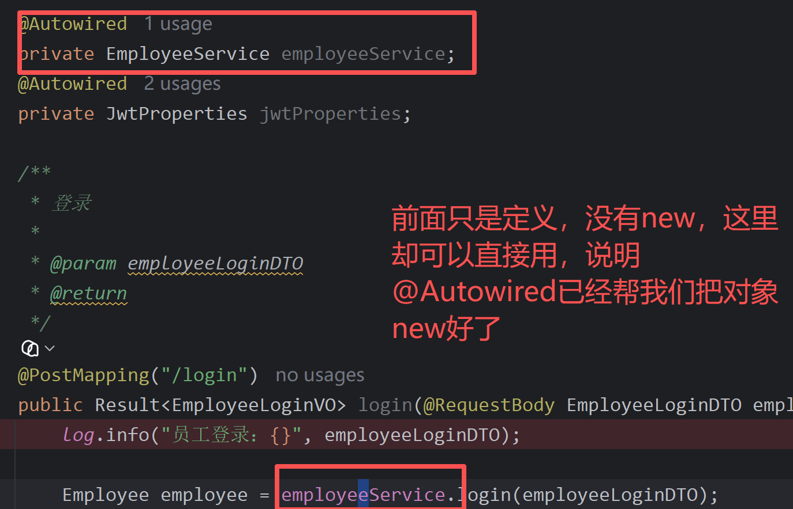
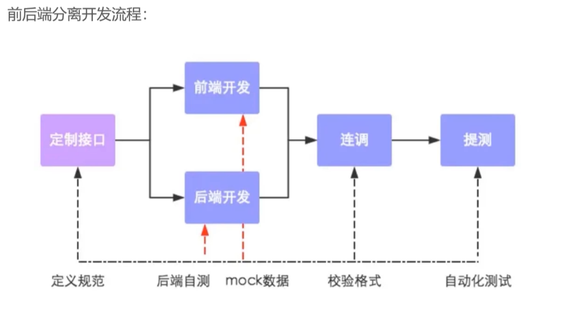

登录功能：

### `@RestController`

这是 Spring 的注解。它的作用就一句话：**告诉 Spring"这个类是用来处理 HTTP 请求的"**。当你启动项目，Spring 会扫描到这个注解，然后把里面的方法自动映射成 HTTP 接口。

### `@RequestMapping("/admin/employee")`

给这个 Controller 下所有接口加一个**统一的前缀**。比如 `@PostMapping("/login")` 加上这个前缀，实际访问路径就是 `POST /admin/employee/login`。

### `@Slf4j`

这是 Lombok 提供的注解。它在编译时**自动给你生成一个 `log` 对象**，让你可以在代码里写 `log.info("xxx")` 打印日志，而不需要手动 new 一个日志对象。属于减少模板代码的语法糖。

### `@Autowired`

这个是 Spring 的核心机制 —— **依赖注入**。你不写 `new EmployeeService()`，而是声明 `@Autowired`，Spring 启动时会自动帮你把 `EmployeeService` 的实现类对象创建好并塞进来。意思就是说，@Autowired会直接帮你把对象new好。具体理解如图所示。

> **类比理解**：就像你去餐厅吃饭，你不用自己进厨房炒菜（new 对象），服务员（Spring）会把做好的菜端到你桌上（注入）。



## `@RequestBody EmployeeLoginDTO employeeLoginDTO`

前端发来的 JSON 数据是这样的：

JSON

```json
{
    "username": "admin",
    "password": "123456"
}
```

`@RequestBody` 做的就是：**自动把 JSON 转换成 Java 对象**。

对照 EmployeeLoginDTO：

Java

```java
public class EmployeeLoginDTO {
    private String username;   // JSON的 "username" → 存到这个字段
    private String password;   // JSON的 "password" → 存到这个字段
}
```

Spring 自动做了这件事：

Plain Text

```
JSON:  { "username": "admin", "password": "123456" }
                    ↓  @RequestBody 自动转换
Java:  一个 EmployeeLoginDTO 对象，username="admin", password="123456"
```

你不用自己解析 JSON，Spring 帮你把前端传过来的 JSON **自动装填**进了这个对象。

简单来说，@RequestBody的意思就是spring把前端传过来的JSON转换成Java对象，具体转成什么样，看EmployeeLoginDTO，转完之后赋给employeeLoginDTO。

## 返回值 `Result<EmployeeLoginVO>`

这是方法处理完后，返回给前端的"包裹"。看 Result：

Java

```java
public class Result<T> {
    private Integer code;   // 1=成功, 0=失败
    private String msg;     // 错误提示
    private T data;         // 真正要返回的数据，类型 T 就是尖括号里写的那个
}
```

`T` 是**泛型**，你可以理解为"占位符"。当你写 `Result<EmployeeLoginVO>` 时，相当于：

Java

```java
public class Result {
    private Integer code;
    private String msg;
    private EmployeeLoginVO data;   // T 被替换成了 EmployeeLoginVO
}
```

最终返回给前端的 JSON 长这样：

JSON

```json
{
    "code": 1,
    "msg": null,
    "data": {
        "id": 1,
        "userName": "admin",
        "name": "管理员",
        "token": "eyJhbGci..."
    }
}
```

## @Service和@Autowired之间是协作关系，一个负责"放进去"，一个负责"拿出来"

```
@Service                                   @Autowired
  │                                           │
  │  "我是一个 Service，                       │  "我需要一个 EmployeeService，
  │   把我放进 Spring 容器"                      │   从容器里找一个给我"
  │                                            │
  ▼                                            ▼
  ┌──────────────────────────────────────────────────┐
  │                   Spring 容器                      │
  │                                                   │
  │   EmployeeServiceImpl  ←──── 匹配 ────→  EmployeeService
  │   (具体实现类)                            (接口类型)
  │                                                   │
  └──────────────────────────────────────────────────┘
```

用项目里的真实代码看：

```java
// 这一步：@Service 把 EmployeeServiceImpl 放入容器
@Service
public class EmployeeServiceImpl implements EmployeeService { ... }

// 这一步：@Autowired 从容器里取出 EmployeeServiceImpl，赋给 employeeService
@Autowired
private EmployeeService employeeService;
```

## `@Mapper的作用`

EmployeeMapper.java

```java
@Mapper
public interface EmployeeMapper {
```

**谁扫描**：MyBatis

**MyBatis 做了什么**：

```
MyBatis 启动时扫描到 @Mapper
        │
        ▼
"这是个 interface，用户肯定不想自己写实现类，我来帮他生成一个"
        │
        ▼
生成一个代理类（运行时动态创建），大致逻辑：

        当有人调用 getByUsername("admin") 时：
          1. 看这个方法上的 @Select 注解
          2. 拿到 SQL: "select * from employee where username = #{username}"
          3. 把 #{username} 替换成 "admin"
          4. 去数据库执行 SQL
          5. 把查到的结果行映射成 Employee 对象
          6. 返回这个 Employee 对象
        │
        ▼
把这个代理对象交给 Spring 管理
```

**效果**：`EmployeeServiceImpl` 里写 `@Autowired private EmployeeMapper` 时，Spring 注入的就是 MyBatis 生成的这个代理对象。你调 `employeeMapper.getByUsername("admin")`，它自动跑 SQL。

而`@Select` 的作用→ 告诉 MyBatis "这个方法对应哪条 SQL"。

简单来说，`@Mapper` + `@Autowired`也是协作关系。

**生产者** — EmployeeMapper.java：

```java
@Mapper                          // MyBatis: "我来生成实现类，完事交给 Spring"
public interface EmployeeMapper {
```

**消费者** — EmployeeServiceImpl.java：

```java
@Autowired                       // Spring: "从容器里取一个 EmployeeMapper，给你"
private EmployeeMapper employeeMapper;
```

---

## 一句话总结

> `@Service` + `@Autowired` = Spring 自己生产，自己消费 `@Mapper` + `@Autowired` = MyBatis 生产，交给 Spring 仓库，Spring 再帮你消费

不管是哪种，`@Autowired` 只管"从仓库取"，不关心是谁放进去的。这就是依赖注入的精髓。

执行 `select * from employee where username = 'admin'` 后，MyBatis 把这一整行映射成 `Employee` 对象返回。

```
employee 表
┌────┬──────────┬──────────┬──────────┬────────┐
│ id │ username │ name     │ password │ status │
├────┼──────────┼──────────┼──────────┼────────┤
│  1 │ admin    │ 管理员   │ 123456   │      1 │
└────┴──────────┴──────────┴──────────┴────────┘
```

## 顺带一提：`#{ }` vs `${ }`

MyBatis 里有两个占位符，区别很重要：

| 写法            | 示例                             | 实际生成的 SQL                             | 安全吗         |
| ------------- | ------------------------------ | ------------------------------------- | ----------- |
| `#{username}` | `where username = #{username}` | `where username = 'admin'`            | 安全，防 SQL 注入 |
| `${username}` | `where username = ${username}` | `where username = admin`（少了引号，还可能有注入） | 不安全         |

> 一句话：永远用 `#{}`，别用 `${}`。

## `@Data 是 Lombok 注解`

自动生成所有字段的 **getter、setter、toString、equals、hashCode**。

你看到的 `Employee` 类只有字段，没有 getter/setter，但你可以在代码里直接写：

```java
employee.getUsername();   // Lombok 自动生成的
employee.setPassword("xxx");
```

相当于 Lombok 帮你悄悄生成了下面这些"长代码"：

```java
// getter/setter 你不用手写，Lombok 编译时加上
public Long getId() { return this.id; }
public void setId(Long id) { this.id = id; }
// ... 每个字段都生成一对 getter/setter
```

## `@NoArgsConstructor` 和 `@AllArgsConstructor`也是Lombok的注解，功能和@Data类似

这两个是**构造函数**：

```java
@NoArgsConstructor   // → 生成：public Employee() { }
@AllArgsConstructor  // → 生成：public Employee(Long id, String username, String name,
                      //          String password, String phone, String sex,
                      //          String idNumber, Integer status, ...) { ... }
```

| 注解                    | 生成的代码                                        | 什么时候用       |
| --------------------- | -------------------------------------------- | ----------- |
| `@NoArgsConstructor`  | 无参构造 `new Employee()`                        | 框架反射创建对象时需要 |
| `@AllArgsConstructor` | 全参构造 `new Employee(id, username, name, ...)` | 一次性填完所有字段   |

## `@Builder`

用Builder：

```java
// EmployeeController.java 第 54-59 行
EmployeeLoginVO employeeLoginVO = EmployeeLoginVO.builder()   // 先创建一个建造者
        .id(employee.getId())        // 链式填入需要的字段
        .userName(employee.getUsername())
        .name(employee.getName())
        .token(token)
        .build();                    // 最后 build() 生成完整对象
```

不用 Builder 的话，你得写：

```java
// 传统方式：要么一个个 set，要么构造器传一堆参数
EmployeeLoginVO vo = new EmployeeLoginVO();
vo.setId(employee.getId());
vo.setUserName(employee.getUsername());
vo.setName(employee.getName());
vo.setToken(token);
```

**Builder 的好处**：链式调用 + 只填需要的字段，干净清晰。

`throw` 就是"扔出一个问题，后面的代码不执行了"，然后异常沿着调用链往回弹。

类比：你在窗口办业务，缺材料 → 工作人员直接告诉你"办不了"，不会继续走后面的流程。然后把问题抛回来给你。

```
throw new AccountNotFoundException("账号不存在");
// 这行以后的代码不会执行，直接跳到异常处理器
```

## 代码钟的三个异常都继承自 `BaseException`

```
RuntimeException  (Java 自带的)
       │
  BaseException  (项目自定义的"业务异常"父类)
       │
  ├── AccountNotFoundException   (账号不存在)
  ├── PasswordErrorException     (密码错误)
  └── AccountLockedException     (账号被锁定)
```

`RuntimeException` 已经把异常的所有机制都做好了：

- 存错误信息 ✅
- 堆栈追踪 ✅
- 中断程序 ✅

异常处理的两个常用注解：

- `@RestControllerAdvice` = Spring 的全局异常捕手，专门拦截所有 Controller 里抛出的异常
- `@ExceptionHandler` = 指明"我只抓 BaseException 类型的异常"

**一步一步追踪，从 `throw` 到前端收到响应。**

---

## 第一步：Service 层抛出

EmployeeServiceImpl.java

```java
if (employee == null) {
    throw new AccountNotFoundException("账号不存在");
}
```

执行到 `throw` 的瞬间：

- 一个 `AccountNotFoundException` 对象被创建
- Service 的 `login` 方法**立即结束**，后面代码不执行
- 异常沿着调用链往回弹

---

## 第二步：异常沿着调用链回溯

```
EmployeeServiceImpl.login()         ← throw 发生在这里
        │
        │ 异常向上抛
        ▼
EmployeeController.login()          ← Controller 调用了 Service.login()
        │
        │ Controller 也没有 try-catch，异常继续上抛
        ▼
Spring 框架                         ← Spring 接管了这次 HTTP 请求的处理
        │
        │ Spring 问："有没有人注册了全局异常处理器？"
        ▼
找到了！@RestControllerAdvice
```

---

## 第三步：Spring 匹配异常处理器

Spring 扫描到 `GlobalExceptionHandler` 上有两个关键注解：

GlobalExceptionHandler.java

```java
@RestControllerAdvice          // ① "我是全局异常处理器"
public class GlobalExceptionHandler {

    @ExceptionHandler           // ② "我处理 BaseException 类型的异常"
    public Result exceptionHandler(BaseException ex) {
        ...
    }
}
```

Spring 的判断逻辑：

```
抛出的异常：AccountNotFoundException
                │
                │ Spring 沿着继承链往上找
                ▼
        AccountNotFoundException → BaseException → RuntimeException
                │
                │ "BaseException 匹配！"
                ▼
        调用 GlobalExceptionHandler.exceptionHandler()
```

---

## 第四步：异常处理器返回 JSON 给前端

```java
public Result exceptionHandler(BaseException ex) {
    log.error("异常信息：{}", ex.getMessage());       // 后台打印日志
    return Result.error(ex.getMessage());              // 返回给前端
}
```

`Result.error("账号不存在")` 等价于：

```json
{
    "code": 0,
    "msg": "账号不存在",
    "data": null
}
```

---

## 完整时间线

```
时间线    发生了什么
─────────────────────────────────────────
 ①      前端 POST /admin/employee/login
 ②      Controller.login() 调用 Service.login()
 ③      Service 里 employee == null，throw AccountNotFoundException
 ④      异常上抛到 Spring 框架层
 ⑤      Spring 找到 @RestControllerAdvice → GlobalExceptionHandler
 ⑥      Spring 发现 @ExceptionHandler 匹配 BaseException
 ⑦      调用 exceptionHandler(ex)，返回 Result.error("账号不存在")
 ⑧      Spring 把 Result 转成 JSON → 前端
```

`String` 是键的类型，`Object` 是值的类型。

```java
Map<String, Object> claims = new HashMap<>();
//   ↑ key类型  ↑ value类型
```

用 `Object` 作为 value 类型，意味着你可以塞**任何类型**的值进去：

```java
claims.put("empId", 1L);                    // Long 可以
claims.put("name", "admin");                // String 可以
claims.put("loginTime", LocalDateTime.now()); // 时间也可以
```

因为 Java 里所有类都是 `Object` 的子类，所以 `Object` 能接住任何东西。

## `@Component`

和 `@Service` 一样，告诉 Spring："把这个类（JwtProperties）放容器里管理"。

## `@ConfigurationProperties(prefix = "sky.jwt")`

**把 yml 配置文件里的值，自动装填到这个类（JwtProperties）的字段里。**

对照看。yml 里写的：

```yaml
# application.yml
sky:
  jwt:
    admin-secret-key: itcast
    admin-ttl: 7200000
    admin-token-name: token
```

`@ConfigurationProperties(prefix = "sky.jwt")` 的意思就是：**去配置里找 `sky.jwt` 开头的部分**。

然后按名字自动匹配到字段：

```
yml 里的名字                         类的字段                  值
──────────────────────────────────────────────────────────────────
sky.jwt.admin-secret-key      →     adminSecretKey      →    "itcast"
sky.jwt.admin-ttl             →     adminTtl            →    7200000
sky.jwt.admin-token-name      →     adminTokenName      →    "token"
```

---

## 整个过程

```
项目启动
    │
    ├── Spring 读 application.yml
    │
    ├── 发现 @ConfigurationProperties(prefix = "sky.jwt")
    │       │
    │       └── 自动赋值：
    │           adminSecretKey = "itcast"
    │           adminTtl = 7200000
    │           adminTokenName = "token"
    │
    └── @Component → 放进容器 → Controller 里 @Autowired 注入就能用
```

---

## 这个类就是一个"配置搬运工"

它的唯一作用：**把散落在 yml 里的配置值，集中到一个 Java 对象里**。其他地方要用配置，直接注入 `JwtProperties`，不用到处手写 `"itcast"` 或者 `7200000`。

```java
// Controller 里
jwtProperties.getAdminSecretKey();   // "itcast"
jwtProperties.getAdminTtl();         // 7200000
```

还有一个你之前没注意到的细节：yml 里写的是 `admin-secret-key`（短线分隔），Java 字段是 `adminSecretKey`（驼峰）。Spring 自动做了 `-` 到驼峰的转换，名字对得上就行。

前端的请求不是直接发到后端的，而是先发到Nginx服务器，再由Nginx转发到后端（反向代理）。这样可以保证后端的安全，也可以按照需求转发到不同的后端服务器（负载均衡），在这里，Nginx相当于是一个中间管理员。

password = DigestUtils.md5DigestAsHex(password.getBytes());使用DigestUtils.md5DigestAsHex可以对密码进行加密，是md5算法。

在正式的代码开发之前，前端和后端要进行非常漫长的接口设计讨论。然后前后端其实是并行开发的。


