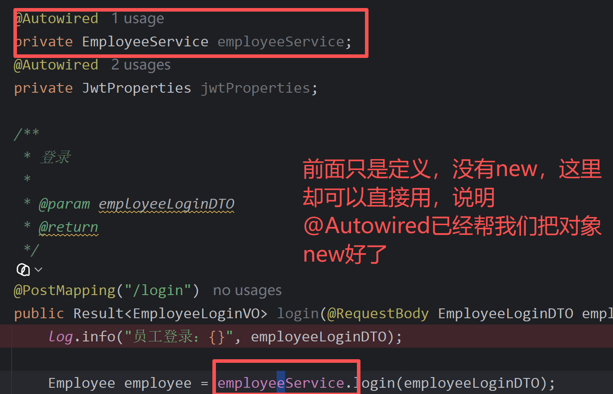
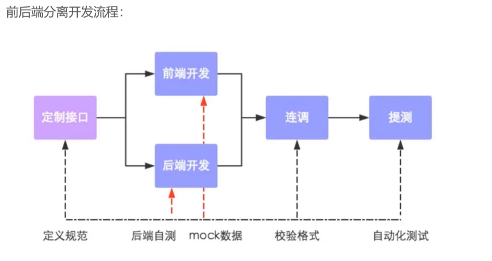
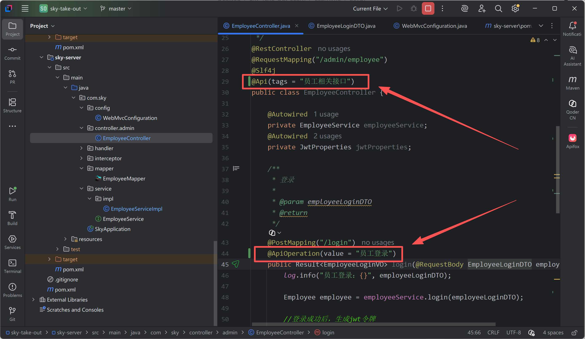
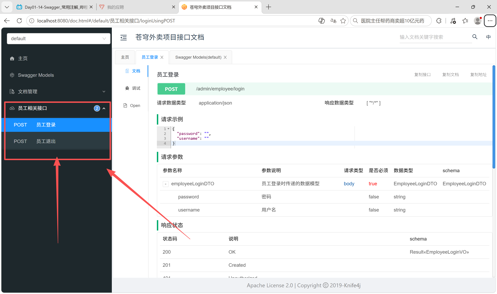
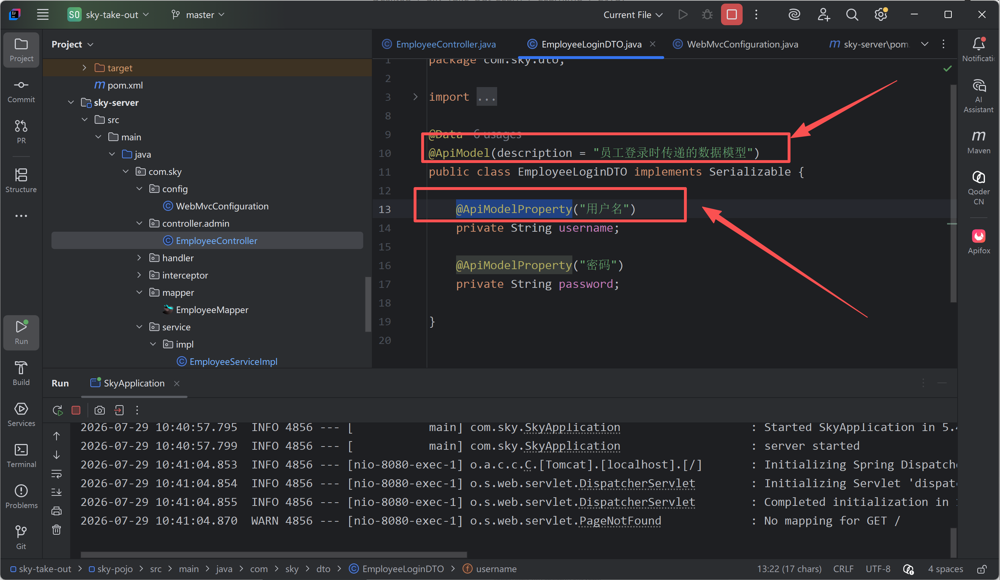
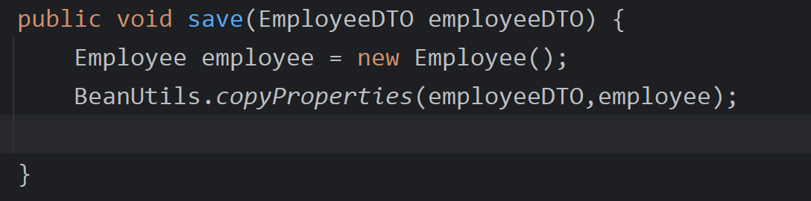
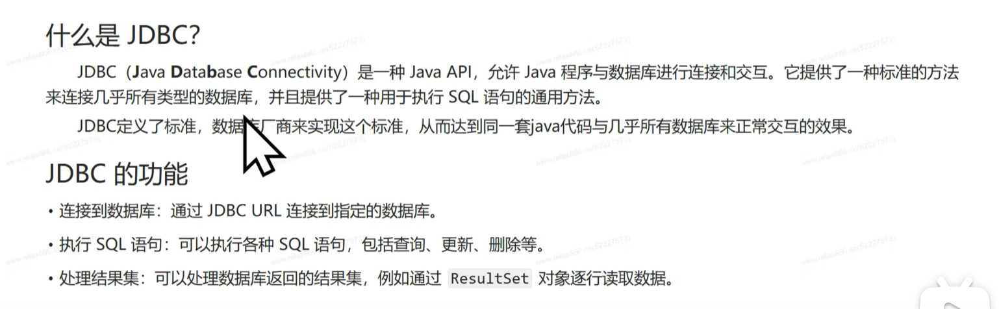

登录功能：

### `@RestController`

这是 Spring 的注解。它的作用就一句话：**告诉 Spring"这个类是用来处理 HTTP 请求的"**。当你启动项目，Spring 会扫描到这个注解，然后把里面的方法自动映射成 HTTP 接口。

### `@RequestMapping("/admin/employee")`

给这个 Controller 下所有接口加一个**统一的前缀**。比如 `@PostMapping("/login")` 加上这个前缀，实际访问路径就是 `POST /admin/employee/login`。

### `@Slf4j`

这是 Lombok 提供的注解。它在编译时**自动给你生成一个 `log` 对象**，让你可以在代码里写 `log.info("xxx")` 打印日志，而不需要手动 new 一个日志对象。属于减少模板代码的语法糖。

### `@Autowired`

这个是 Spring 的核心机制 —— **依赖注入**。你不写 `new EmployeeService()`，而是声明 `@Autowired`，Spring 启动时会自动帮你把 `EmployeeService` 的实现类对象创建好并塞进来。意思就是说，@Autowired会直接帮你把对象new好。具体理解如图所示。

> **类比理解**：就像你去餐厅吃饭，你不用自己进厨房炒菜（new 对象），服务员（Spring）会把做好的菜端到你桌上（注入）。



## `@RequestBody EmployeeLoginDTO employeeLoginDTO`

前端发来的 JSON 数据是这样的：

JSON

```json
{
    "username": "admin",
    "password": "123456"
}
```

`@RequestBody` 做的就是：**自动把 JSON 转换成 Java 对象**。

对照 EmployeeLoginDTO：

Java

```java
public class EmployeeLoginDTO {
    private String username;   // JSON的 "username" → 存到这个字段
    private String password;   // JSON的 "password" → 存到这个字段
}
```

Spring 自动做了这件事：

Plain Text

```
JSON:  { "username": "admin", "password": "123456" }
                    ↓  @RequestBody 自动转换
Java:  一个 EmployeeLoginDTO 对象，username="admin", password="123456"
```

你不用自己解析 JSON，Spring 帮你把前端传过来的 JSON **自动装填**进了这个对象。

简单来说，@RequestBody的意思就是spring把前端传过来的JSON转换成Java对象，具体转成什么样，看EmployeeLoginDTO，转完之后赋给employeeLoginDTO。

## 返回值 `Result<EmployeeLoginVO>`

这是方法处理完后，返回给前端的"包裹"。看 Result：

Java

```java
public class Result<T> {
    private Integer code;   // 1=成功, 0=失败
    private String msg;     // 错误提示
    private T data;         // 真正要返回的数据，类型 T 就是尖括号里写的那个
}
```

`T` 是**泛型**，你可以理解为"占位符"。当你写 `Result<EmployeeLoginVO>` 时，相当于：

Java

```java
public class Result {
    private Integer code;
    private String msg;
    private EmployeeLoginVO data;   // T 被替换成了 EmployeeLoginVO
}
```

最终返回给前端的 JSON 长这样：

JSON

```json
{
    "code": 1,
    "msg": null,
    "data": {
        "id": 1,
        "userName": "admin",
        "name": "管理员",
        "token": "eyJhbGci..."
    }
}
```

## @Service和@Autowired之间是协作关系，一个负责"放进去"，一个负责"拿出来"

```
@Service                                   @Autowired
  │                                           │
  │  "我是一个 Service，                       │  "我需要一个 EmployeeService，
  │   把我放进 Spring 容器"                      │   从容器里找一个给我"
  │                                            │
  ▼                                            ▼
  ┌──────────────────────────────────────────────────┐
  │                   Spring 容器                      │
  │                                                   │
  │   EmployeeServiceImpl  ←──── 匹配 ────→  EmployeeService
  │   (具体实现类)                            (接口类型)
  │                                                   │
  └──────────────────────────────────────────────────┘
```

用项目里的真实代码看：

```java
// 这一步：@Service 把 EmployeeServiceImpl 放入容器
@Service
public class EmployeeServiceImpl implements EmployeeService { ... }

// 这一步：@Autowired 从容器里取出 EmployeeServiceImpl，赋给 employeeService
@Autowired
private EmployeeService employeeService;
```

## `@Mapper的作用`

EmployeeMapper.java

```java
@Mapper
public interface EmployeeMapper {
```

**谁扫描**：MyBatis

**MyBatis 做了什么**：

```
MyBatis 启动时扫描到 @Mapper
        │
        ▼
"这是个 interface，用户肯定不想自己写实现类，我来帮他生成一个"
        │
        ▼
生成一个代理类（运行时动态创建），大致逻辑：

        当有人调用 getByUsername("admin") 时：
          1. 看这个方法上的 @Select 注解
          2. 拿到 SQL: "select * from employee where username = #{username}"
          3. 把 #{username} 替换成 "admin"
          4. 去数据库执行 SQL
          5. 把查到的结果行映射成 Employee 对象
          6. 返回这个 Employee 对象
        │
        ▼
把这个代理对象交给 Spring 管理
```

**效果**：`EmployeeServiceImpl` 里写 `@Autowired private EmployeeMapper` 时，Spring 注入的就是 MyBatis 生成的这个代理对象。你调 `employeeMapper.getByUsername("admin")`，它自动跑 SQL。

而`@Select` 的作用→ 告诉 MyBatis "这个方法对应哪条 SQL"。

简单来说，`@Mapper` + `@Autowired`也是协作关系。

**生产者** — EmployeeMapper.java：

```java
@Mapper                          // MyBatis: "我来生成实现类，完事交给 Spring"
public interface EmployeeMapper {
```

**消费者** — EmployeeServiceImpl.java：

```java
@Autowired                       // Spring: "从容器里取一个 EmployeeMapper，给你"
private EmployeeMapper employeeMapper;
```

***

## 一句话总结

> `@Service` + `@Autowired` = Spring 自己生产，自己消费 `@Mapper` + `@Autowired` = MyBatis 生产，交给 Spring 仓库，Spring 再帮你消费

不管是哪种，`@Autowired` 只管"从仓库取"，不关心是谁放进去的。这就是依赖注入的精髓。

执行 `select * from employee where username = 'admin'` 后，MyBatis 把这一整行映射成 `Employee` 对象返回。

```
employee 表
┌────┬──────────┬──────────┬──────────┬────────┐
│ id │ username │ name     │ password │ status │
├────┼──────────┼──────────┼──────────┼────────┤
│  1 │ admin    │ 管理员   │ 123456   │      1 │
└────┴──────────┴──────────┴──────────┴────────┘
```

## 顺带一提：`#{ }` vs `${ }`

MyBatis 里有两个占位符，区别很重要：

| 写法            | 示例                             | 实际生成的 SQL                             | 安全吗         |
| ------------- | ------------------------------ | ------------------------------------- | ----------- |
| `#{username}` | `where username = #{username}` | `where username = 'admin'`            | 安全，防 SQL 注入 |
| `${username}` | `where username = ${username}` | `where username = admin`（少了引号，还可能有注入） | 不安全         |

> 一句话：永远用 `#{}`，别用 `${}`。

## `@Data 是 Lombok 注解`

自动生成所有字段的 **getter、setter、toString、equals、hashCode**。

你看到的 `Employee` 类只有字段，没有 getter/setter，但你可以在代码里直接写：

```java
employee.getUsername();   // Lombok 自动生成的
employee.setPassword("xxx");
```

相当于 Lombok 帮你悄悄生成了下面这些"长代码"：

```java
// getter/setter 你不用手写，Lombok 编译时加上
public Long getId() { return this.id; }
public void setId(Long id) { this.id = id; }
// ... 每个字段都生成一对 getter/setter
```

## `@NoArgsConstructor` 和 `@AllArgsConstructor`也是Lombok的注解，功能和@Data类似

这两个是**构造函数**：

```java
@NoArgsConstructor   // → 生成：public Employee() { }
@AllArgsConstructor  // → 生成：public Employee(Long id, String username, String name,
                      //          String password, String phone, String sex,
                      //          String idNumber, Integer status, ...) { ... }
```

| 注解                    | 生成的代码                                        | 什么时候用       |
| --------------------- | -------------------------------------------- | ----------- |
| `@NoArgsConstructor`  | 无参构造 `new Employee()`                        | 框架反射创建对象时需要 |
| `@AllArgsConstructor` | 全参构造 `new Employee(id, username, name, ...)` | 一次性填完所有字段   |

## `@Builder`

用Builder：

```java
// EmployeeController.java 第 54-59 行
EmployeeLoginVO employeeLoginVO = EmployeeLoginVO.builder()   // 先创建一个建造者
        .id(employee.getId())        // 链式填入需要的字段
        .userName(employee.getUsername())
        .name(employee.getName())
        .token(token)
        .build();                    // 最后 build() 生成完整对象
```

不用 Builder 的话，你得写：

```java
// 传统方式：要么一个个 set，要么构造器传一堆参数
EmployeeLoginVO vo = new EmployeeLoginVO();
vo.setId(employee.getId());
vo.setUserName(employee.getUsername());
vo.setName(employee.getName());
vo.setToken(token);
```

**Builder 的好处**：链式调用 + 只填需要的字段，干净清晰。

`throw` 就是"扔出一个问题，后面的代码不执行了"，然后异常沿着调用链往回弹。

类比：你在窗口办业务，缺材料 → 工作人员直接告诉你"办不了"，不会继续走后面的流程。然后把问题抛回来给你。

```
throw new AccountNotFoundException("账号不存在");
// 这行以后的代码不会执行，直接跳到异常处理器
```

## 代码钟的三个异常都继承自 `BaseException`

```
RuntimeException  (Java 自带的)
       │
  BaseException  (项目自定义的"业务异常"父类)
       │
  ├── AccountNotFoundException   (账号不存在)
  ├── PasswordErrorException     (密码错误)
  └── AccountLockedException     (账号被锁定)
```

`RuntimeException` 已经把异常的所有机制都做好了：

- 存错误信息 ✅

- 堆栈追踪 ✅

- 中断程序 ✅

异常处理的两个常用注解：

- `@RestControllerAdvice` = Spring 的全局异常捕手，专门拦截所有 Controller 里抛出的异常

- `@ExceptionHandler` = 指明"我只抓 BaseException 类型的异常"

**一步一步追踪，从 `throw` 到前端收到响应。**

***

## 第一步：Service 层抛出

EmployeeServiceImpl.java

```java
if (employee == null) {
    throw new AccountNotFoundException("账号不存在");
}
```

执行到 `throw` 的瞬间：

- 一个 `AccountNotFoundException` 对象被创建

- Service 的 `login` 方法**立即结束**，后面代码不执行

- 异常沿着调用链往回弹

***

## 第二步：异常沿着调用链回溯

```
EmployeeServiceImpl.login()         ← throw 发生在这里
        │
        │ 异常向上抛
        ▼
EmployeeController.login()          ← Controller 调用了 Service.login()
        │
        │ Controller 也没有 try-catch，异常继续上抛
        ▼
Spring 框架                         ← Spring 接管了这次 HTTP 请求的处理
        │
        │ Spring 问："有没有人注册了全局异常处理器？"
        ▼
找到了！@RestControllerAdvice
```

***

## 第三步：Spring 匹配异常处理器

Spring 扫描到 `GlobalExceptionHandler` 上有两个关键注解：

GlobalExceptionHandler.java

```java
@RestControllerAdvice          // ① "我是全局异常处理器"
public class GlobalExceptionHandler {

    @ExceptionHandler           // ② "我处理 BaseException 类型的异常"
    public Result exceptionHandler(BaseException ex) {
        ...
    }
}
```

Spring 的判断逻辑：

```
抛出的异常：AccountNotFoundException
                │
                │ Spring 沿着继承链往上找
                ▼
        AccountNotFoundException → BaseException → RuntimeException
                │
                │ "BaseException 匹配！"
                ▼
        调用 GlobalExceptionHandler.exceptionHandler()
```

***

## 第四步：异常处理器返回 JSON 给前端

```java
public Result exceptionHandler(BaseException ex) {
    log.error("异常信息：{}", ex.getMessage());       // 后台打印日志
    return Result.error(ex.getMessage());              // 返回给前端
}
```

`Result.error("账号不存在")` 等价于：

```json
{
    "code": 0,
    "msg": "账号不存在",
    "data": null
}
```

***

## 完整时间线

```
时间线    发生了什么
─────────────────────────────────────────
 ①      前端 POST /admin/employee/login
 ②      Controller.login() 调用 Service.login()
 ③      Service 里 employee == null，throw AccountNotFoundException
 ④      异常上抛到 Spring 框架层
 ⑤      Spring 找到 @RestControllerAdvice → GlobalExceptionHandler
 ⑥      Spring 发现 @ExceptionHandler 匹配 BaseException
 ⑦      调用 exceptionHandler(ex)，返回 Result.error("账号不存在")
 ⑧      Spring 把 Result 转成 JSON → 前端
```

`String` 是键的类型，`Object` 是值的类型。

```java
Map<String, Object> claims = new HashMap<>();
//   ↑ key类型  ↑ value类型
```

用 `Object` 作为 value 类型，意味着你可以塞**任何类型**的值进去：

```java
claims.put("empId", 1L);                    // Long 可以
claims.put("name", "admin");                // String 可以
claims.put("loginTime", LocalDateTime.now()); // 时间也可以
```

因为 Java 里所有类都是 `Object` 的子类，所以 `Object` 能接住任何东西。

## `@Component`

和 `@Service` 一样，告诉 Spring："把这个类（JwtProperties）放容器里管理"。

## `@ConfigurationProperties(prefix = "sky.jwt")`

**把 yml 配置文件里的值，自动装填到这个类（JwtProperties）的字段里。**

对照看。yml 里写的：

```yaml
# application.yml
sky:
  jwt:
    admin-secret-key: itcast
    admin-ttl: 7200000
    admin-token-name: token
```

`@ConfigurationProperties(prefix = "sky.jwt")` 的意思就是：**去配置里找 `sky.jwt` 开头的部分**。

然后按名字自动匹配到字段：

```
yml 里的名字                         类的字段                  值
──────────────────────────────────────────────────────────────────
sky.jwt.admin-secret-key      →     adminSecretKey      →    "itcast"
sky.jwt.admin-ttl             →     adminTtl            →    7200000
sky.jwt.admin-token-name      →     adminTokenName      →    "token"
```

***

## 整个过程

```
项目启动
    │
    ├── Spring 读 application.yml
    │
    ├── 发现 @ConfigurationProperties(prefix = "sky.jwt")
    │       │
    │       └── 自动赋值：
    │           adminSecretKey = "itcast"
    │           adminTtl = 7200000
    │           adminTokenName = "token"
    │
    └── @Component → 放进容器 → Controller 里 @Autowired 注入就能用
```

***

## 这个类就是一个"配置搬运工"

它的唯一作用：**把散落在 yml 里的配置值，集中到一个 Java 对象里**。其他地方要用配置，直接注入 `JwtProperties`，不用到处手写 `"itcast"` 或者 `7200000`。

```java
// Controller 里
jwtProperties.getAdminSecretKey();   // "itcast"
jwtProperties.getAdminTtl();         // 7200000
```

还有一个你之前没注意到的细节：yml 里写的是 `admin-secret-key`（短线分隔），Java 字段是 `adminSecretKey`（驼峰）。Spring 自动做了 `-` 到驼峰的转换，名字对得上就行。

前端的请求不是直接发到后端的，而是先发到Nginx服务器，再由Nginx转发到后端（反向代理）。这样可以保证后端的安全，也可以按照需求转发到不同的后端服务器（负载均衡），在这里，Nginx相当于是一个中间管理员。

password = DigestUtils.md5DigestAsHex(password.getBytes());使用DigestUtils.md5DigestAsHex可以对密码进行加密，是md5算法。

在正式的代码开发之前，前端和后端要进行非常漫长的接口设计讨论。然后前后端其实是并行开发的。



## Swagger/Knife4j — 自动生成接口文档

```java
@Bean
public Docket docket() {
    // ...配置 Swagger
}
```

**Swagger 是干啥的**：你不需要手写接口文档。项目启动后，访问 `http://localhost:8080/doc.html` ，自动展示所有接口，而且能**在线测试**。

这就是一个界面，自动把你的所有 Controller 接口列出来。简单来说，就是开发前期，前端还没写好，后端想测试，就用Swagger技术。

## 静态资源映射

```java
protected void addResourceHandlers(ResourceHandlerRegistry registry) {
    registry.addResourceHandler("/doc.html")...   // 让 Swagger 的页面能访问到
    registry.addResourceHandler("/webjars/**")... // Swagger 依赖的 JS/CSS 文件
}
```

让 Swagger 页面能正常加载显示，纯配置，不用深究。

## `@Configuration`

等于 **"我是配置类"** 版的 `@Component`。作用和 `@Service`、`@Component` 一样——让 Spring 管这个类。但它的特别之处在于：**里面可以放 `@Bean` 方法**。

***

## `@Bean`

看 WebMvcConfiguration.java 这个方法：

```java
@Bean
public Docket docket() {
    // ... 自己 new、自己配置
    Docket docket = new Docket(DocumentationType.SWAGGER_2)
            .apiInfo(apiInfo)
            // ...
    return docket;    // 返回的对象交给 Spring 管理
}
```

`@Bean` 的意思是：**这个方法返回的对象，放进 Spring 容器**。

@Api、@ApiOperation的功能如图所示





@ApiModel、@ApiModelProperty注解的作用如图所示




当前端提交过来的数据和实体类中对应的属性差别较大时，建议新建一个专门的DTO来封装数据。比如说前端就传了个账号密码来，再拿完整的employ实体去接就不太合理。

BeanUtils.copyProperties(employeeDTO,employee);可以把employeeDTO的属性赋值给employee，不用一行行拿出来再赋，前提是属性名称要一个个对得上。



在Java项目开发中，如果要设置常量，也是通过类来封装的，如图所示，StatusConstant.ENABLE就是一个常量，放在StatusConstant这个类里面。


***

我们平常写代码的时候，调用别人写好的工具类，这些代码不用我们再次从头开始写，这就是框架的雏形，把常用的一些东西封装起来方便复用。而Spring就像是一个小瓶子，可以把你的对象放在这个Spring瓶子里进行管理。如图所示。SpringBoot可以通过注解的的方式在容器中创建类的对象。SpringBoot内嵌了Tomcat服务器，在运行启动类的时候，Tomcat服务器就启动成功了。


***

可以简单把SpringBoot理解成Spring和SpringMVC的整合。SpringBoot说白了就是一个map，它的key是String，value是object。SpringBoot在启动的时候会扫描所有的类到那个抽象的“map”里面，key就是类名，value就是这个类。Spring是单例模式，也就是说，这个value是单例，key是名字。

***

那问题来了，SpringBoot在启动的时候，它怎么知道要把哪些类存到这个map里面？这个时候就需要注解，比如说@component。简单来说，只需要在类上加这个注解，就可以把这个类扫描到这个map里面去。

***

entity层是对数据库的映射，比方说数据库里有几张表，然后在entity里映射出来。Dao专门写和数据库交互的操作，增删改查，只负责数据存取，不处理业务逻辑。Dao 只做数据库 CRUD，**不写业务判断、计算**，业务交给 Service。MyBatis 里叫 Mapper 接口，就是 Dao；Spring‑Data‑JPA 叫 Repository，本质也是 Dao 层。Service层放的是业务代码。Controller是给前端调的，接收请求返回响应。

***

调用逻辑是：前端→Controller → Service → Dao → Entity ↔ 数据库表。那问题来了，Controller怎么知道要调用的Service类在哪里呢？其实在SpringBoot启动的时候，就已经把这些类都扫描到容器里了，用的时候，只需要根据名字，也就是key去找对应的value（也就是类）就可以了。这也就是注入的概念，从容器里拿到类注入到Controller里面，怎么注入的呢？也是通过注解的形式。

***

Redis也可以理解成一个Map，也是key是string，value是object。Java是基于内存的，Redis也是基于内存的，内存速度快，读取很快。所以Redis的核心是快。Redis可以做公共变量，比方说有AB两个模块，这两个模块要进行通讯，要进行存储，A模块产生的数据需要B模块访问，这个时候就可以把数据存到公共变量上去，也就是Redis，然后B就可以读取了。A模块通过远程RPC调用，通过HTTP把数据存到Redis里，B模块通过HTTP去Redis里面拿。可以把Redis理解成一个Java服务，部署在服务器上。

***

Redis集群，其实就是为了防崩，把主节点的数据拷贝到子节点上，哪怕主节点崩了也不怕。怎么拷贝呢，也是通过HTTP请求。

***

MySQL的索引，可以理解为就是数据库的目录，类似书本目录，页码，通过目录，页码去快定位数据的位置。索引也是基于内存的，所以特别快，MySQL慢是因为它是基于硬盘的。索引页是存在内存里的。

***

索引失效的时候，其中一个例子就是索引顺序反了。全表扫描就是从头开始一个个找。

***

JDBC就是一种JavaAPI，允许Java程序与数据库进行连接和交互，它定义了标准。



***

如果用原生的JDBC，会有大量的重复代码，而MyBatis就是把那些重复代码给封装掉，其底层还是基于JDBC。

***

- MyBatis：半 ORM，SQL 自己写，灵活，互联网后端主流

- JPA/Hibernate：全 ORM，几乎不用写 SQL，封装太重，SQL 不好调优

---

### 一、Spring Boot 是什么

Spring Boot 是由 Pivotal（现 VMware）团队基于 Spring Framework 打造的**快速应用开发脚手架**，核心设计理念是**约定优于配置（Convention over Configuration）**。它彻底解决了传统 Spring 项目中依赖管理繁琐、XML 配置冗余、部署流程复杂等痛点，让开发者可以专注于业务逻辑开发，快速搭建生产级 Spring 应用。

### 二、核心特性

1. **起步依赖（Starters）** Starters 是一组预打包的依赖集合，将特定场景所需的 Maven/Gradle 依赖整合在一起。例如引入 `spring-boot-starter-web` 就自动引入 Spring MVC、Tomcat、Jackson 等全套 Web 开发依赖，无需手动协调版本，彻底避免依赖冲突。
2. **自动配置（Auto-Configuration）** 根据类路径中存在的依赖、环境变量、配置文件等信息，**自动装配 Spring 容器中的 Bean**。比如类路径存在 `spring-webmvc` 时，会自动配置 DispatcherServlet、视图解析器、消息转换器等组件，无需开发者手动编写配置。
3. **内嵌 Servlet 容器** 内置 Tomcat、Jetty、Undertow 三种容器，默认使用 Tomcat。应用可以直接打成可执行 JAR 包，通过 `java -jar` 命令启动，无需额外部署外部 Web 容器。
4. **生产级运维能力（Actuator）** 通过 `spring-boot-starter-actuator` 提供丰富的监控端点，支持健康检查、运行指标、环境变量、Bean 信息等在线查看，方便生产环境的运维与监控。
5. **零代码生成与零 XML 配置** 全程基于 Java 注解与配置类实现，无需编写任何 XML 配置文件，也不会生成额外的冗余代码。

### 三、自动配置核心原理

自动配置是 Spring Boot 最核心的机制，其底层由以下几部分支撑：

#### 1. 核心注解 `@SpringBootApplication`

这是启动类上的复合注解，包含三个核心注解：

- `@SpringBootConfiguration`：本质就是 `@Configuration`，标记该类为 Spring 配置类。
- `@EnableAutoConfiguration`：开启自动配置的核心入口。
- `@ComponentScan`：默认扫描启动类所在包及其子包下的所有组件（`@Component`、`@Service`、`@Controller` 等）。

#### 2. 自动配置加载流程

`@EnableAutoConfiguration` 通过 `AutoConfigurationImportSelector` 类，读取类路径下 `META-INF/spring/org.springframework.boot.autoconfigure.AutoConfiguration.imports` 文件（Spring Boot 2.7 之前为 `spring.factories`），加载其中定义的所有自动配置类全限定名。

#### 3. 条件装配机制

每个自动配置类都带有条件注解，只有满足条件时配置才会生效，常见条件注解：

- `@ConditionalOnClass`：类路径存在指定类时生效
- `@ConditionalOnMissingBean`：容器中不存在指定 Bean 时生效
- `@ConditionalOnProperty`：配置文件中存在指定属性时生效
- `@ConditionalOnWebApplication`：Web 应用环境下生效

#### 4. 配置属性绑定

通过 `@ConfigurationProperties` 注解，将 `application.yml` / `application.properties` 中的配置项批量绑定到 Java Bean 的属性上，实现配置与代码的解耦。

### 四、核心功能与常用组件

#### 1. 配置管理

- 配置文件格式：支持 `application.properties`（键值对）和 `application.yml`（层级结构，更推荐）。
- 多环境配置：通过 `application-dev.yml`、`application-test.yml`、`application-prod.yml` 区分环境，用 `spring.profiles.active` 指定激活的环境。
- 配置优先级：命令行参数 > 系统环境变量 > 应用配置文件 > 配置类。

#### 2. Web 开发

- 自动集成 Spring MVC，支持 RESTful 接口开发、静态资源映射、文件上传等。
- 全局异常处理：通过 `@RestControllerAdvice` + `@ExceptionHandler` 实现统一异常拦截。
- 参数校验：引入 `spring-boot-starter-validation`，基于 JSR-380 规范实现入参校验。

#### 3. 数据访问

- 关系型数据库：整合 JDBC、Spring Data JPA、MyBatis / MyBatis-Plus，自动配置数据源、事务管理器。
- 缓存中间件：整合 Redis、Caffeine 等缓存，通过 `@Cacheable` 等注解快速实现缓存。
- 事务管理：通过 `@Transactional` 注解快速开启声明式事务。

#### 4. 常用 Starter 一览

表格

| Starter 名称                     | 功能说明                          |
| ------------------------------ | ----------------------------- |
| spring-boot-starter-web        | Web 应用开发（含 Tomcat、Spring MVC） |
| spring-boot-starter-data-jpa   | JPA 方式访问数据库                   |
| spring-boot-starter-data-redis | Redis 缓存与数据操作                 |
| spring-boot-starter-security   | 认证与权限控制                       |
| spring-boot-starter-validation | 参数校验                          |
| spring-boot-starter-test       | 单元测试与集成测试                     |
| mybatis-spring-boot-starter    | MyBatis 整合（第三方）               |

### 五、Spring Boot 启动流程

1. **初始化阶段**：执行 `SpringApplication.run()`，创建 SpringApplication 实例，推断应用类型（Servlet / Reactive / 普通），加载初始化器与监听器。
2. **环境准备**：创建并配置 `Environment`，加载配置文件、环境变量、命令行参数等。
3. **Banner 打印**：输出 Spring Boot 启动 Logo。
4. **创建上下文**：根据应用类型创建对应的 `ApplicationContext`。
5. **刷新上下文**：执行 Spring 容器刷新流程，完成 Bean 的扫描、解析、实例化、自动配置等所有核心逻辑。
6. **启动完成**：执行 `CommandLineRunner` / `ApplicationRunner` 回调，完成启动后自定义逻辑。

### 六、生态与版本

#### 1. 主流生态

- **Spring Cloud**：基于 Spring Boot 的微服务全家桶，提供服务注册发现、配置中心、网关、熔断降级等微服务能力。
- **Spring Boot Admin**：可视化管理界面，集中监控多个 Spring Boot 应用的 Actuator 端点。
- **Docker 支持**：原生支持构建 Docker 镜像，结合 Jib、Buildpacks 等工具可快速实现容器化部署。
- **自定义 Starter**：开发者可以封装通用能力为自定义 Starter，实现业务组件的复用。

#### 2. 版本说明

- **3.x 系列**：当前主流版本，基于 Spring Framework 6，要求 **Java 17+**，支持 Jakarta EE 9+，新特性包括 AOT 编译、虚拟线程支持等。
- **2.x 系列**：兼容 Java 8，其中 2.7.x 是 2.x 最后一个稳定版本，官方已停止 OSS 维护，仅提供商业支持。

### 七、核心优势总结

- 开发效率高：配置极简，依赖管理简单，快速搭建项目。
- 生态完善：无缝对接 Spring 全家桶与第三方技术栈。
- 部署简单：内嵌容器，JAR 包即开即用，适配容器化部署。
- 运维友好：内置监控端点，快速对接生产运维体系。

---

**自定义 Starter 开发**。它是 Spring Boot “约定优于配置” 设计理念的延伸，也是企业级开发中封装通用组件、抽离公共业务、实现代码复用的标准方式。

### 一、什么是自定义 Starter

Starter 本质上是一个**预装配的依赖包**，它把特定功能所需的依赖、配置类、默认参数、Bean 注册逻辑全部封装在一起。使用者只需要引入这个 Starter 的 Maven 坐标，就能自动获得对应能力，无需手动配置 Bean、管理依赖版本。

官方 Starter 解决了通用技术栈的集成问题，而自定义 Starter 用来解决**业务通用能力的复用问题**，比如统一的日志组件、权限校验、数据库操作封装、接口限流、监控埋点等场景。

### 二、强制命名规范

Spring Boot 有严格的命名约定，用来区分官方组件和第三方 / 业务组件，避免命名冲突：

- **官方 Starter**：命名格式为 `spring-boot-starter-*`，例如 `spring-boot-starter-web`、`spring-boot-starter-data-redis`。
- **第三方 / 自定义 Starter**：命名格式为 `*-spring-boot-starter`，前缀为自定义名称，例如 `mybatis-spring-boot-starter`、`druid-spring-boot-starter`。

> 核心原则：官方保留 `spring-boot-starter-` 前缀命名空间，自定义 Starter 禁止占用该前缀。

### 三、自定义 Starter 的核心原理

自定义 Starter 的底层完全依托 Spring Boot 的自动配置体系，核心由三部分组成：

1. **条件装配**：通过 `@Conditional` 系列注解，精准控制配置类的生效时机。
2. **配置属性绑定**：通过 `@ConfigurationProperties` 读取配置文件中的自定义参数，覆盖默认值。
3. **自动配置注册**：在指定文件中注册自动配置类，让 Spring Boot 启动时自动扫描加载。

### 四、完整实现步骤（极简示例）

我们以实现一个 “接口请求日志打印” 的自定义 Starter 为例：

#### 1. 创建 Maven 项目，引入核心依赖

```
<dependencies>
    <!-- 自动配置核心依赖 -->
    <dependency>
        <groupId>org.springframework.boot</groupId>
        <artifactId>spring-boot-autoconfigure</artifactId>
    </dependency>
    <!-- 配置元数据处理器，让 IDE 支持配置参数提示 -->
    <dependency>
        <groupId>org.springframework.boot</groupId>
        <artifactId>spring-boot-configuration-processor</artifactId>
        <optional>true</optional>
    </dependency>
    <!-- Web 依赖，仅编译期需要，运行期由宿主项目提供 -->
    <dependency>
        <groupId>org.springframework.boot</groupId>
        <artifactId>spring-boot-starter-web</artifactId>
        <scope>provided</scope>
    </dependency>
</dependencies>
```

#### 2. 编写配置属性类

用来接收 `application.yml` 中的配置参数，并提供默认值：

```
@ConfigurationProperties(prefix = "biz.log")
public class BizLogProperties {
    // 是否开启日志，默认开启
    private boolean enable = true;
    // 日志标识前缀
    private String prefix = "BIZ-API";

    // getter / setter 方法省略
}
```

#### 3. 编写自动配置类

这是 Starter 的核心，负责向 Spring 容器注册功能 Bean：

```
@Configuration
@EnableConfigurationProperties(BizLogProperties.class)
@ConditionalOnWebApplication // 仅 Web 应用环境下生效
@ConditionalOnProperty(prefix = "biz.log", name = "enable", havingValue = "true", matchIfMissing = true)
public class BizLogAutoConfiguration {

    @Bean
    @ConditionalOnMissingBean // 容器中不存在该 Bean 时才注册，允许用户自定义覆盖
    public LogInterceptor logInterceptor(BizLogProperties properties) {
        return new LogInterceptor(properties);
    }
}
```

#### 4. 注册自动配置类

在项目的 `resources/META-INF/spring/` 目录下，创建 `org.springframework.boot.autoconfigure.AutoConfiguration.imports` 文件，内容为自动配置类的全限定名：

```
com.example.bizlog.BizLogAutoConfiguration
```

> 说明：Spring Boot 2.7 之前的版本，需要写在 `META-INF/spring.factories` 文件中。

### 五、使用方式

其他业务项目引入该 Starter 依赖后，直接在配置文件中按需调整参数即可：

```
biz:
  log:
    enable: true
    prefix: "ORDER-SERVICE"
```

无需编写任何额外代码，项目启动后日志拦截器就会自动生效。

### 六、核心设计思想总结

自定义 Starter 的本质是**“可插拔的自动配置”**：

- 开箱即用：引入依赖即自动生效
- 约定优先：提供合理的默认值，零配置即可运行
- 按需生效：通过条件注解精准控制加载场景
- 可定制化：允许用户通过配置文件或自定义 Bean 覆盖默认逻辑

---

**`@Transactional` 声明式事务管理**。它是 Spring 事务抽象的核心体现，在 Spring Boot 中通过自动配置即可开箱即用，是保证数据一致性的关键手段。

### 一、什么是声明式事务

Spring 提供了两种事务管理方式：

- **编程式事务**：手动编写代码开启、提交、回滚事务，侵入性强、代码冗余。
- **声明式事务**：基于 AOP 动态代理实现，通过 `@Transactional` 注解标注方法 / 类，在方法执行前自动开启事务，执行成功自动提交，抛出异常自动回滚，业务代码与事务逻辑完全解耦。

Spring Boot 会根据类路径中的数据源依赖，**自动配置事务管理器**（比如引入 JDBC 则自动装配 `DataSourceTransactionManager`，引入 JPA 则自动装配 `JpaTransactionManager`），开发者只需添加注解即可使用。

### 二、核心实现原理

1. **动态代理增强** Spring 容器启动时，会为标注了 `@Transactional` 的 Bean 创建代理对象。调用目标方法时，实际调用的是代理对象，由代理对象在方法执行前后插入事务逻辑：
- 方法执行前：获取事务管理器，开启事务
- 方法正常返回：提交事务
- 方法抛出异常：根据回滚规则判断是否回滚事务
2. **事务管理器 `PlatformTransactionManager`** 这是 Spring 事务的核心接口，定义了事务的开启、提交、回滚标准。不同数据访问技术对应不同实现：
- JDBC/MyBatis：`DataSourceTransactionManager`
- JPA/Hibernate：`JpaTransactionManager`
- Redis：`RedisTransactionManager`

Spring Boot 的自动配置会根据依赖自动注入对应的事务管理器。

3. **事务属性定义 `TransactionDefinition`** 注解中的参数最终会封装为事务属性，控制事务的行为规则。

### 三、核心注解参数详解

表格

| 参数            | 说明                          | 默认值                            |
| ------------- | --------------------------- | ------------------------------ |
| `propagation` | 事务传播行为，控制多个事务方法嵌套调用时的事务处理方式 | `Propagation.REQUIRED`         |
| `isolation`   | 事务隔离级别，对应数据库的隔离等级           | `Isolation.DEFAULT`（跟随数据库默认）   |
| `timeout`     | 事务超时时间，单位秒                  | -1（永不超时）                       |
| `readOnly`    | 是否为只读事务，优化查询性能              | false                          |
| `rollbackFor` | 指定触发回滚的异常类型                 | 仅 `RuntimeException` 和 `Error` |

#### 重点：3 种常用事务传播行为

- **`REQUIRED`（默认）**：如果当前存在事务则加入，没有则新建一个事务。最常用，适用于绝大多数场景。
- **`REQUIRES_NEW`**：无论当前是否存在事务，都新建一个独立事务；外层事务不影响内层，内层事务提交 / 回滚互不干扰。适用于需要独立提交的子逻辑。
- **`NESTED`**：嵌套事务，内层事务是外层事务的子事务；内层回滚只回滚自己的保存点，不影响外层；外层回滚会连带内层一起回滚。

### 四、高频踩坑清单（实战必看）

这是开发中最容易导致事务失效的 6 个场景：

1. **方法非 public 修饰** Spring AOP 仅支持对 public 方法进行代理，`@Transactional` 标注在 private/protected 方法上**完全不生效**，且不会报错。
2. **同类方法直接调用（this 调用）** 同一个类中，方法 A 直接调用本类加了 `@Transactional` 的方法 B，事务不会生效。因为 this 调用的是原对象，不是代理对象，绕过了事务拦截逻辑。
3. **异常被 try-catch 捕获** 方法内捕获了异常且没有重新抛出，Spring 感知不到异常，**不会触发回滚**。
4. **错误的回滚异常类型** 默认只对 `RuntimeException`（运行时异常）和 `Error` 回滚，对 `Exception` 下的受检异常（如 `IOException`、`SQLException`）**不回滚**。需要手动指定 `rollbackFor = Exception.class`。
5. **多数据源下事务管理器不匹配** 多数据源项目中，如果没有指定对应的事务管理器，注解会找不到正确的事务管理器，导致事务失效。
6. **数据库引擎不支持事务** 以 MySQL 为例，MyISAM 引擎不支持事务，即使注解配置正确，数据库层面也无法回滚。

### 五、最佳实践

- 优先在接口实现类或 public 方法上标注注解，避免标注在接口上（CGLIB 代理会失效）。
- 明确指定 `rollbackFor = Exception.class`，覆盖受检异常场景。
- 同类调用场景下，通过注入自身代理对象或使用 `TransactionTemplate` 编程式事务规避。
- 查询方法标注 `readOnly = true`，可提升数据库性能。

---

### Spring Boot 全局异常处理体系

这是前后端分离架构下的**必备工程化实践**，基于 Spring MVC 的异常拦截机制实现，用来统一所有 REST 接口的错误返回格式、屏蔽底层异常细节、规范错误码与日志打印，避免每个 Controller 单独写 try-catch 造成的代码冗余。

#### 一、核心底层原理

Spring MVC 请求处理的完整异常链路：

1. 请求进入 `DispatcherServlet` 后，分发给对应 Controller 方法执行业务逻辑。
2. 业务方法抛出异常时，会沿调用栈向上抛出，最终由 `HandlerExceptionResolver` 异常解析器链处理。
3. Spring Boot 默认提供了基础异常处理：访问 `/error` 路径的 `BasicErrorController`，返回默认错误页或简单 JSON，但格式不统一、信息不可控，无法满足业务需求。

全局异常处理的核心是 **`@RestControllerAdvice` + `@ExceptionHandler`** 组合：

- `@RestControllerAdvice` 本质是 `@ControllerAdvice` + `@ResponseBody`，是一个全局切面，会拦截所有 Controller 层抛出的异常。
- `@ExceptionHandler` 标注在方法上，指定要捕获的异常类型，方法内编写处理逻辑，最终直接返回 JSON 格式的统一结果。

#### 二、标准实现示例

1. 先定义统一的错误响应结构

```
@Data
public class ErrorResult {
    // 错误码
    private Integer code;
    // 用户友好提示
    private String message;
}
```

2. 编写全局异常处理器

```
@RestControllerAdvice
public class GlobalExceptionHandler {

    // 1. 捕获自定义业务异常（可预知的业务错误，如余额不足、参数非法）
    @ExceptionHandler(BusinessException.class)
    public ErrorResult handleBusinessException(BusinessException e) {
        ErrorResult result = new ErrorResult();
        result.setCode(e.getCode());
        result.setMessage(e.getMessage());
        return result;
    }

    // 2. 捕获参数校验异常（@Valid 校验失败抛出的异常）
    @ExceptionHandler(MethodArgumentNotValidException.class)
    public ErrorResult handleValidException(MethodArgumentNotValidException e) {
        String msg = e.getBindingResult().getFieldError().getDefaultMessage();
        ErrorResult result = new ErrorResult();
        result.setCode(400);
        result.setMessage("参数校验失败：" + msg);
        return result;
    }

    // 3. 兜底：捕获所有未处理的系统异常
    @ExceptionHandler(Exception.class)
    public ErrorResult handleException(Exception e) {
        // 后端打印完整堆栈日志，前端只返回通用提示
        log.error("系统异常", e);
        ErrorResult result = new ErrorResult();
        result.setCode(500);
        result.setMessage("服务器内部错误，请稍后重试");
        return result;
    }
}
```

#### 三、关键规则与踩坑点

1. **异常匹配优先级**：会优先匹配最精确的异常类型，找不到才会向上匹配父类异常。比如抛出 `NullPointerException`，会先找有没有对应的处理器，没有才会走到 `Exception` 的兜底方法。
2. **局部优先于全局**：如果 Controller 类内部用 `@ExceptionHandler` 定义了局部异常处理，会优先执行局部逻辑，全局处理器不生效。
3. **无法拦截的场景**：
   - 过滤器（Filter）、拦截器（Interceptor）中抛出的异常，还没进入 Controller 层，不会被 `@RestControllerAdvice` 捕获。
   - 404 路径不存在、403 权限不足等 Servlet 层面的异常，需要通过自定义 `BasicErrorController` 处理。
4. **扫描范围控制**：`@RestControllerAdvice` 默认扫描整个项目，多模块项目可通过 `basePackages` 指定只拦截指定包下的 Controller。

#### 四、最佳实践

- 拆分**业务异常**和**系统异常**：业务异常带自定义错误码和明确提示，系统异常统一返回通用提示，避免泄露服务器信息。
- 系统异常必须打印完整堆栈日志，方便排查问题；业务异常只打印关键信息，避免日志冗余。
- 生产环境关闭异常详情返回，只保留错误码和用户友好提示。

---

# SpringBoot 内嵌 Tomcat

## 概念

SpringBoot 默认**内嵌 Tomcat**，不需要外部单独安装 Tomcat 服务器，项目打包成 jar 直接就可以运行 web 服务；这也是 SpringBoot 推荐 jar 包部署而不是 war 包部署的根本原因。

> 老 Spring MVC 项目：打成 war → 放到外部 Tomcat 的 webapps 目录下，启动外部 Tomcat。
> SpringBoot：内置 Tomcat，main 方法启动，直接运行。

## 底层原理

1. SpringBoot 的 web 启动器`spring‑boot‑starter‑web`依赖里面已经引入了`tomcat‑embed‑*`内嵌 tomcat 相关 jar 包。
2. 在 SpringBoot 自动配置`ServletWebServerFactoryAutoConfiguration`中，会创建`TomcatServletWebServerFactory`工厂。
3. 容器刷新完成之后，SpringBoot 会利用这个工厂**自动实例化内嵌 Tomcat 实例**，启动 web 容器，绑定端口，部署当前 Spring 应用。

## 常用自定义配置（application.yml）

```
server:
  port: 8081          # 修改服务端口
  tomcat:
    max-threads: 200  # tomcat最大工作线程数
    min-spare-threads: 10 # 最小空闲线程
    max-connections: 8192 #最大连接数
    uri-encoding: UTF-8   #url编码
```

## 替换内嵌 web 容器（面试高频）

starter‑web 默认是 Tomcat，可以排除 Tomcat，切换成 Jetty 或者 Undertow。
以 Undertow 举例：

```
<dependency>
    <groupId>org.springframework.boot</groupId>
    <artifactId>spring-boot-starter-web</artifactId>
    <!--排除tomcat-->
    <exclusions>
        <exclusion>
            <groupId>org.springframework.boot</groupId>
            <artifactId>spring-boot-starter-tomcat</artifactId>
        </exclusion>
    </exclusions>
</dependency>
<!--引入undertow-->
<dependency>
    <groupId>org.springframework.boot</groupId>
    <artifactId>spring-boot-starter-undertow</artifactId>
</dependency>
```

## 面试要点 & 踩坑

1. **什么时候还用 war 包？** 有些老旧服务器强制使用外部 Tomcat 部署；此时需要排除内嵌 tomcat，修改启动类继承`SpringBootServletInitializer`。
2. 内嵌 Tomcat 的线程池：`max‑threads`不是越大越好，受服务器 CPU 核心数约束。
3. Undertow 优势：NIO 非阻塞，长连接性能更好；Jetty 适合频繁热部署开发场景；Tomcat 兼容性最好，业务最通用。
4. 注意：内嵌 Tomcat 就是普通 Java 对象，随 Spring 应用生命周期一起销毁；应用停止，Tomcat 直接关闭。

---

# SpringBoot：Actuator 监控端点

## 一、是什么

Spring Boot Actuator 是 SpringBoot 内置的监控组件，提供一系列**端点 (endpoint)**，用来查看应用运行状态、健康情况、指标、日志、环境变量，方便运维和线上排查问题。引入依赖之后就可以暴露接口访问。

## 二、引入依赖（maven）

```
<dependency>
    <groupId>org.springframework.boot</groupId>
    <artifactId>spring-boot-starter-actuator</artifactId>
</dependency>
```

## 三、核心常用端点

- `/actuator/health`：健康检查，返回应用健康状态（数据库、redis 连通性等），默认只返回 UP/DOWN；可以配置显示详细详情。
- `/actuator/info`：自定义应用信息，版本、项目描述。
- `/actuator/beans`：打印 Spring 容器中所有 Bean。
- `/actuator/env`：读取环境变量、配置文件属性。
- `/actuator/metrics`：JVM 指标，堆内存、线程数、GC 次数、http 请求统计。

> 默认只暴露 health、info 两个端点；其他端点需要手动开启暴露。

## 四、application.yml 配置示例

```
management:
  endpoints:
    web:
      exposure:
        include: health,info,beans,metrics #暴露哪些端点
  endpoint:
    health:
      show-details: always #总是显示health详细信息
```

## 五、自定义 HealthIndicator（扩展健康检查）

可以自己写类实现`HealthIndicator`，加入自定义业务健康检测，例如检测第三方接口是否连通。

```
@Component
public class CustomHealthCheck implements HealthIndicator {
    @Override
    public Health health() {
        boolean ok = checkBiz();
        if(ok){
            return Health.up().withDetail("msg","业务服务正常").build();
        }else{
            return Health.down().withDetail("msg","业务服务异常").build();
        }
    }
    private boolean checkBiz(){
        //自己写业务检测逻辑
        return true;
    }
}
```

## 六、面试要点

1. Actuator 本身只是提供原始监控数据；可视化一般搭配 SpringBoot Admin 做图形页面。
2. **线上不要全部开放所有端点**，会泄露配置、bean 信息，存在安全风险，生产尽量只开放 health 做存活探测。
3. health 返回 UP 经常被 K8s 用作就绪探针、存活探针。
